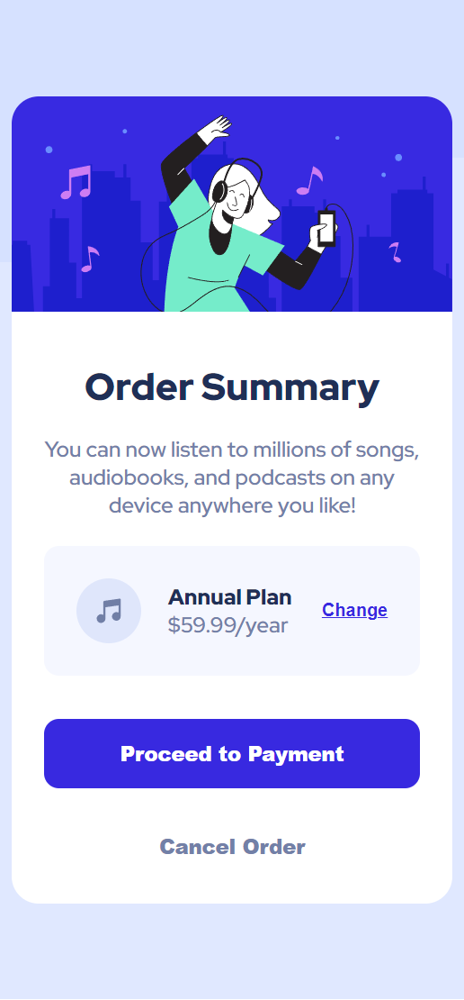

# Frontend Mentor - Order summary card solution

This is a solution to the [Order summary card challenge on Frontend Mentor](https://www.frontendmentor.io/challenges/order-summary-component-QlPmajDUj). Frontend Mentor challenges help you improve your coding skills by building realistic projects.

## Table of contents

-   [Overview](#overview)
    -   [The challenge](#the-challenge)
    -   [Screenshot](#screenshot)
    -   [Links](#links)
-   [My process](#my-process)
    -   [Built with](#built-with)
-   [Author](#author)

## Overview

### The challenge

Users should be able to:

-   See hover states for interactive elements

### Screenshot

### Links

-   [Solution](https://github.com/NataJenkins/order-summary-component)
-   [Live Site](https://profound-croissant-9bbecc.netlify.app)

## My process

### Built with

-   Semantic HTML5 markup
-   CSS custom properties
-   Flexbox
-   Mobile-first workflow
-   [React](https://reactjs.org/) - JS library

## Author

-   Github - [NataJenkins](https://github.com/NataJenkins)
-   Frontend Mentor - [@NataJenkins](https://www.frontendmentor.io/profile/NataJenkins)
-   Linkedin - [natalia0896](https://www.linkedin.com/in/natalia0896/)
